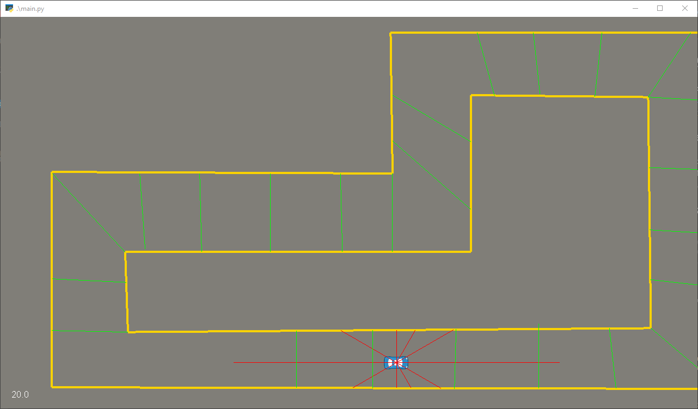

<h1 style="text-align: center">Self-Driving Car in 2D environment, using Deep Q Learning</h1>

This is a fun project that I created to learn Reinforcement Learning, inspired by [CodeBullet's awesome video on YouTube](https://www.youtube.com/watch?v=r428O_CMcpI). It follows literally step-by-step according to his experiment, so maybe no creativity point for me 🐧 But still, it was a fun and educational experience.



## Requirement

- Tensorflow 2.0.0 or higher
- Keras 2.3.1 or higher
- Pyglet 1.4.8 or higher

## How to use

```
python train_deep_q.py # run the Deep Q Learning's Training program. Press ESC to quit and save the model to file "model.h5"
python main.py # import model from "model.h5" to run the self-driving car
```

The repository includes a pretrained `model.h5` that was created after about 40+ epochs, which is not much, but it can finish a full lap around the circus, which is something 🐧